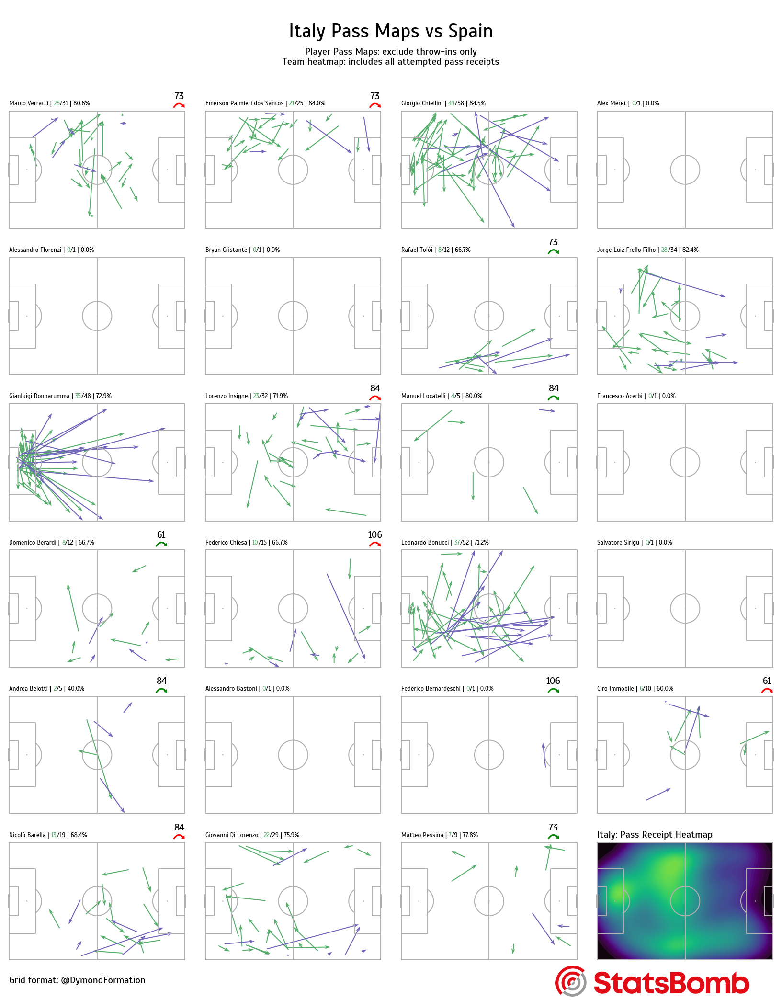
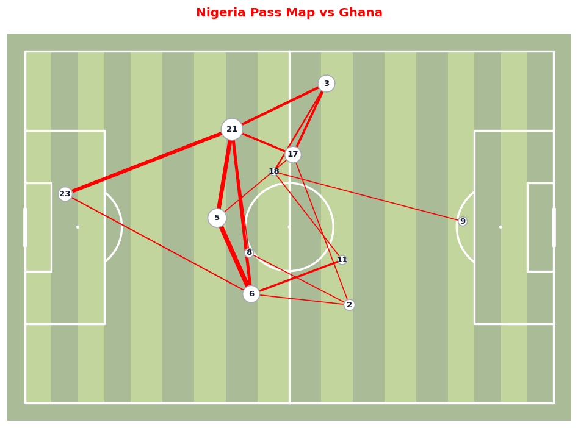

# Soccer pass maps

Pass visualizations from **StatsBomb [open data](https://github.com/statsbomb/open-data)** using **[mplsoccer](https://mplsoccer.readthedocs.io/)** and **[statsbombpy](https://github.com/statsbomb/statsbombpy)**.

**Notebooks** (`.ipynb`) are the **original exploration**. They are **left as-is on purpose**: ad hoc cells, optional `%pip` / `!pip` lines, and wide dataframe outputs are part of that history.

**Maintained code** lives in **`passmap_logic.py`**, the **`.py` scripts**, and **`tests/`**. The scripts share the same helpers where the analysis overlaps; they do not need to match the notebooks line-for-line.

---

## Visualizations

The project produces two main chart types from StatsBomb event data. Examples below use matches from the open dataset; your figures will match these once setup is complete and you run the scripts.

### Individual multi-panel pass map

One mini-pitch per squad member: completed passes (green), incomplete passes (purple), substitution minutes, and a team ball-receipt heatmap.

**Example:** UEFA Euro 2020 semi-final — Italy vs Spain (`match_id=3795220`).



**How to reproduce**

1. Complete [Setup](#setup) (venv + `pip install -r requirements.txt`).
2. From the repo root, run:

   ```bash
   python individual-passmap.py
   ```

3. The script loads that match over the network, builds the 6×4 grid, and opens the figure in a matplotlib window (`plt.show()`).

No prompts — competition, season, and match are hard-coded in the script.

---

### Team jersey network pass map

One pitch: jersey-number nodes at average passer positions, red edges between passer and recipient (line width ∝ pass count). Uses successful passes **before the first substitution**; edges with only one pass are dropped.

**Example:** Africa Cup of Nations — Nigeria vs Ghana (`match_id=3923881`, same as `team-pass-maps.ipynb`).



**How to reproduce**

1. Complete [Setup](#setup).
2. From the repo root, run:

   ```bash
   python passmap-with-input.py
   ```

3. Enter the prompts when asked. For the Nigeria example:

   | Prompt | Value |
   |--------|-------|
   | `competition_id` | `1267` |
   | `season_id` | `107` |
   | `home_team` | `Nigeria` |

   Team names must match StatsBomb strings exactly. The script picks the **first home fixture** for that team in the returned match table (for Nigeria in AFCON 2023 that is Nigeria vs Guinea).

4. The network map opens in a matplotlib window.

To recreate the **Nigeria vs Ghana** preview specifically, use the notebook `team-pass-maps.ipynb` (hard-coded `match_id=3923881`) or point `passmap-with-input.py` at that match after looking up the row in `sb.matches(competition_id=1267, season_id=107)`.

---

### Tournament batch (same layout as individual)

`tournament-passmaps.py` prompts for `competition_id`, `season_id`, and a **team name**, then builds one individual-style figure per match that team played (home or away). It does not call `plt.show()` by default — close each window manually, or add `plt.show()` / `fig.savefig(...)` inside the loop if you want to save outputs.

**Example prompts for Italy at Euro 2020:**

| Prompt | Value |
|--------|-------|
| `competition_id` | `55` |
| `season_id` | `43` |
| team name | `Italy` |

```bash
python tournament-passmaps.py
```

---

## Repository layout

| Path | Purpose |
|------|---------|
| `passmap_logic.py` | Shared **pure pandas** transforms (no HTTP). Used by scripts and tests. |
| `individual-passmap.py` | One **fixed** match: Euro 2020 semi Italy vs Spain → **multi-panel individual** map. |
| `tournament-passmaps.py` | **Prompts** for competition / season / team → loops matches → same **multi-panel** style via `plot_pass_maps`. |
| `passmap-with-input.py` | **Prompts** for competition / season / home team → **one** home fixture → **jersey network** map on a single pitch. |
| `individual-pass-maps.ipynb` | Exploration notebook for the **individual** multi-panel workflow. |
| `team-pass-maps.ipynb` | Exploration notebook for the **network** map workflow. |
| `tests/test_passmap_logic.py` | Unit tests for `passmap_logic`. |
| `pytest.ini` | Pytest config (`pythonpath` = repo root). |
| `requirements.txt` | Pinned runtime dependencies (`pip freeze`). |
| `requirements-dev.txt` | Dev tools (`pytest`). |
| `.gitignore` | Ignores `.venv`, `.ipynb_checkpoints`, caches, etc. |
| `images/ita.png`, `images/sp.png` | Flag images for individual map title (notebook + `individual-passmap.py`). |
| `images/individual-passmap-preview.png` | README example — individual multi-panel map (Italy vs Spain). |
| `images/network-passmap-preview.png` | README example — jersey network map (Nigeria vs Ghana). |

---

## `passmap_logic.py` — what each piece does

This module holds **two** conceptual pipelines plus small utilities.

### Constants

- **`SET_PIECE_TYPES`** — Tuple of set-piece labels (throw-in, free kick, corner, kick-off, goal kick) used elsewhere for documentation; the **individual** scripts only exclude **throw-ins** from player pass arrows, not every set piece in this tuple.
- **`PASS_COLUMNS`** — Column list for **Pass** events used by the **network** pipeline (`team_pass_dataframe`).

### Jersey / pass **network** map (used by `passmap-with-input.py`)

Aligned with `team-pass-maps.ipynb`:

1. **`team_pass_dataframe(team_events)`** — Rows where `type_name == "Pass"`, restricted to `PASS_COLUMNS`.
2. **`successful_passes(passes)`** — Keeps passes with null `outcome_name` (StatsBomb convention for completed passes).
3. **`first_substitution_minute(team_events)`** — Minimum minute among `Substitution` events, or **`None`** if there are none (avoids empty results when comparing to `NaN`).
4. **`filter_passes_before_first_sub(successful, first_sub_minute)`** — Keeps passes with `minute < first_sub_minute`; if `first_sub_minute` is `None`, returns all successful passes.
5. **`attach_jersey_numbers(successful, lineup_jerseys)`** — Merges `player_id` → passer jersey and `pass_recipient_id` → recipient jersey (`how="left"` so missing IDs do not drop rows silently).
6. **`build_pass_network_tables(successful_with_jerseys)`** — Builds:
   - **`average_locations`**: group by passer jersey → mean `x`, `y`, and pass **count** (node size / position).
   - **`pass_between`**: group by (passer jersey, recipient jersey) → `pass_count`; joins start/end average positions; **drops** edges with `pass_count <= 1` (same as the notebook).

**Important:** The second join matches **recipient** jersey to rows in `average_locations`, which is keyed by **passer** jersey. In real data, recipients usually also appear as passers, so edges survive; exotic cases can drop edges.

**Utilities for scripts:**

- **`competition_name_lookup(comps, competition_id, season_id)`** — Single competition name string from the competitions dataframe.
- **`opponent_for_match(match_row, focal_team)`** — Given a match row with `home_team` / `away_team`, returns the **other** team than `focal_team` (fixes titles when your team plays **away**).

### **Individual** multi-panel map (used by `individual-passmap.py` and `tournament-passmaps.py`)

1. **`merge_sub_times_into_lineup(events, lineup)`** — From `Substitution` events, builds sub-**on** (replacement `player_id` + minute) and sub-**off** (player out + minute) tables and left-joins them onto `lineup` so panels can annotate sub minutes.
2. **`roster_for_team(lineup, team_name)`** — One team’s lineup rows.
3. **`passes_excluding_throw_in(events, team_name)`** — That team’s passes excluding `sub_type_name == "Throw-in"` (player arrows).
4. **`pass_receipts_for_team(events, team_name)`** — That team’s **Ball Receipt** events (KDE heatmap).
5. **`squad_size_and_sub_count(lineup_team, starters=11)`** — `(len(lineup_team), max(0, len - 11))` for grid cleanup (`num_sub`).

---

## `individual-passmap.py` — end-to-end logic

1. Load **Euro 2020** `competition_id=55`, `season_id=43`, **`match_id=3795220`** via **`Sbopen`** (`events`, `lineup`).
2. **`merge_sub_times_into_lineup`** on `lineup`.
3. Take **`team1`** as the first unique `team_name` in the merged lineup (Italy in this dataset ordering), build **`lineup_team`** with **`roster_for_team`**.
4. Build **`pass_receipts`** and **`passes_excl_throw`** for that team.
5. **`squad_size_and_sub_count`** → `num_players`, `num_sub`.
6. **Matplotlib / mplsoccer:** `Pitch` grid **6×4**; for each index `< num_players`, draw complete (green) vs incomplete (purple) pass arrows per player; annotate counts with **`highlight_text`**; sub on/off arrows where `on` / `off` are present.
7. On the **last** axes used in the loop, draw **KDE** of **`pass_receipts`** (`cmasher` lavender).
8. Remove unused inner axes with slice **`flat[11 + num_sub : -1]`** (keeps heatmap cell).
9. Title, endnote, **StatsBomb** logo URL, **`images/ita.png`** / **`images/sp.png`** (paths resolved from the script location), **`plt.show()`**.

Comment blocks document optional **notebook-style** exploration (`unique()`, `sb.events`, etc.).

---

## `tournament-passmaps.py` — end-to-end logic

1. **`input()`** for `competition_id`, `season_id`, and **team name** (must match StatsBomb strings).
2. **`sb.matches`** → rows where the team is **home or away**.
3. For each match: **`opponent_for_match`** for the title’s opponent name; **`Sbopen`** `event` + `lineup`.
4. **`plot_pass_maps(focal_team, opponent, events, lineup)`**:
   - Same data prep as **`individual-passmap`**: merge sub times, roster for focal team, passes without throw-ins, receipts for heatmap, 6×4 grid, KDE, axis cleanup, logo, optional flags (commented out by default).

No **`plt.show()`** in the loop (figures stay open until closed; you can add **`plt.show()`** or **`savefig`** per match if you prefer).

---

## `passmap-with-input.py` — end-to-end logic

1. **`input()`** for `competition_id`, `season_id`, **`home_team`**.
2. **`competition_name_lookup`** for subtitle text.
3. **`sb.matches`** filtered to **`home_team == home_team`** only → **first row** `match_id` (first home game in the returned table order—not necessarily a specific round).
4. **`Sbopen`** events for that match → filter to **`team_name == home_team`**.
5. Network pipeline: **`team_pass_dataframe`** → **`successful_passes`** → **`first_substitution_minute`** → **`filter_passes_before_first_sub`** → **`attach_jersey_numbers`** → **`build_pass_network_tables`**.
6. Single **striped** `Pitch`; **lines** between average positions with width from **`pass_count`**; **scatter** nodes sized by volume; jersey **annotations**; **`plt.show()`**.

Comment blocks mirror optional notebook debugging (`print` competitions, optional **`sb.events`**, etc.).

---

## Notebooks (exploration)

### `individual-pass-maps.ipynb`

Same **story** as `individual-passmap.py`: Euro 2020, Italy vs Spain semi, `Sbopen`, substitution merges, throw-in exclusion for player passes, multi-panel grid, receipt heatmap, fonts, **highlight_text**, **cmasher**, logo, flags. Cell order and outputs are for interactive exploration.

### `team-pass-maps.ipynb`

Same **story** as `passmap-with-input.py`: AFCON example, Nigeria, successful passes before first sub, jersey passer/recipient aggregation, **`pass_count > 1`**, one pitch network. Hard-coded `match_id` / competition ids in the notebook.

---

## Assets

- **`images/ita.png`** / **`images/sp.png`** — Used by the **individual** notebook and **`individual-passmap.py`**. The script resolves paths from the **repo root** next to `individual-passmap.py`, so it works even if your shell’s working directory is elsewhere. The notebook uses **`images/sp.png`** paths relative to the **notebook working directory** (usually the project root in VS Code/Cursor).
- **`images/individual-passmap-preview.png`** / **`images/network-passmap-preview.png`** — Static examples embedded in this README. Regenerate by running the scripts in [Visualizations](#visualizations) and saving the figure (`plt.savefig("images/…")` before or instead of `plt.show()`).

---

## Setup

1. Python **3.10+** recommended.
2. Virtual environment (e.g. `.venv` in this folder).
3. Install runtime deps:

   ```bash
   pip install -r requirements.txt
   ```

   `requirements.txt` is a full **`pip freeze`** (pinned). **`pywinpty`** is Windows-only; on Linux/macOS, install there and refresh the lockfile if needed.

4. For notebooks: **Python** + **Jupyter** extensions in the editor; select the venv kernel.

Data loads over the **network** on first use. Large **`DataFrame`** displays can slow the UI—use **`.head()`** / **`.shape`** when exploring.

---

## Tests

```bash
pip install -r requirements-dev.txt
pytest
```

**`pytest.ini`** sets **`pythonpath = .`** so **`import passmap_logic`** works from the repo root.

**`tests/test_passmap_logic.py`** covers: competition name lookup, opponent resolution, pass / sub filtering (including **no substitution**), jersey attachment, network table aggregation (with the recipient-as-passer caveat), sub-time merge into lineup, and individual-style receipt / throw-in filters.

---

## License / data

StatsBomb open data is provided under their [terms](https://github.com/statsbomb/open-data); use accordingly for any public sharing of derived work.
